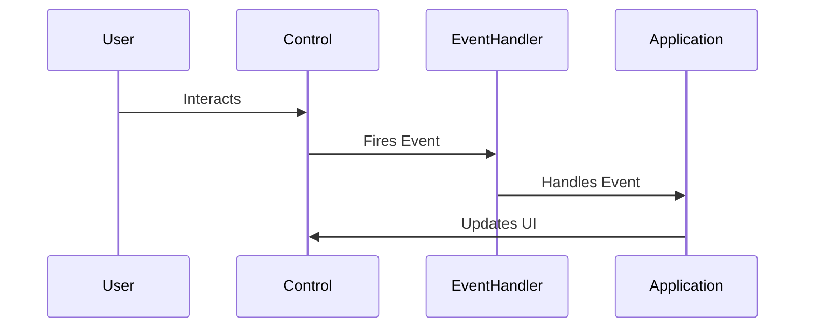

# JavaFX: Modern Desktop Applications

A Complete Guide to Building Rich Client Applications

---

## What is JavaFX?

<div class="process-box">

JavaFX is a software platform for creating desktop applications and rich internet applications (RIAs)

Key Features:
* Modern UI Controls
* CSS Styling Support
* Scene Graph Architecture
* FXML for UI Design
* Rich Animation Framework

```mermaid
graph TB
    A[JavaFX Application]-->B[Scene Graph]
    B-->C[Layout]
    B-->D[Controls]
    B-->E[CSS]
    B-->F[Events]
    classDef default fill:#1a1a1a,stroke:#666
    classDef main fill:#4CAF50,stroke:#666,color:white
    classDef components fill:#2196F3,stroke:#666,color:white
    class A main
    class B,C,D,E,F components
```

</div>



---

## JavaFX Architecture

<div class="process-box">
The Scene Graph is a hierarchical tree of nodes that represents the visual elements

* Stage (Window)
* Scene (Container)
* Nodes (UI Elements)

```mermaid
graph TB
    A[Stage]-->B[Scene]
    B-->C[Root Node]
    C-->D[VBox]
    C-->E[HBox]
    D-->F[Button]
    D-->G[Label]
    E-->H[TextField]
    E-->I[ImageView]
    classDef default fill:#1a1a1a,stroke:#666
    classDef container fill:#4CAF50,stroke:#666,color:white
    classDef element fill:#2196F3,stroke:#666,color:white
    class A,B,C container
    class D,E,F,G,H,I element
```

</div>



---

## Basic Application Structure

```java
package com.example;

import javafx.application.Application;
import javafx.scene.Scene;
import javafx.scene.control.Label;
import javafx.scene.layout.StackPane;
import javafx.stage.Stage;

public class HelloFX extends Application {
    @Override
    public void start(Stage stage) {
        // Create the UI components
        Label label = new Label("Hello, JavaFX!");
        
        // Create a layout container
        StackPane root = new StackPane(label);
        
        // Create the scene
        Scene scene = new Scene(root, 300, 200);
        
        // Set up and show the stage
        stage.setTitle("My First JavaFX App");
        stage.setScene(scene);
        stage.show();
    }

    public static void main(String[] args) {
        launch();
    }
}
```

---

## Layouts in JavaFX

<div class="process-box">
JavaFX provides various layout panes for organizing UI elements:

* VBox - Vertical arrangement
* HBox - Horizontal arrangement
* GridPane - Grid-based layout
* BorderPane - Border-based regions
* StackPane - Stacked elements
* FlowPane - Flowing elements

```mermaid
graph TB
    A[Layout Panes]-->B[VBox]
    A-->C[HBox]
    A-->D[GridPane]
    A-->E[BorderPane]
    A-->F[StackPane]
    A-->G[FlowPane]
    classDef default fill:#1a1a1a,stroke:#666
    classDef main fill:#4CAF50,stroke:#666,color:white
    classDef layouts fill:#2196F3,stroke:#666,color:white
    class A main
    class B,C,D,E,F,G layouts
```

</div>



---

## UI Controls

```java
// Button example
Button button = new Button("Click Me!");
button.setOnAction(e -> System.out.println("Button clicked!"));

// TextField example
TextField textField = new TextField();
textField.setPromptText("Enter your name");

// ComboBox example
ComboBox<String> comboBox = new ComboBox<>();
comboBox.getItems().addAll("Option 1", "Option 2", "Option 3");

// TableView example
TableView<Person> table = new TableView<>();
TableColumn<Person, String> nameCol = new TableColumn<>("Name");
nameCol.setCellValueFactory(new PropertyValueFactory<>("name"));
table.getColumns().add(nameCol);
```

---

## Event Handling

<div class="process-box">
JavaFX uses an event-driven programming model
</div>



```java
button.setOnAction(event -> {
    // Handle button click
    System.out.println("Button clicked!");
});

textField.setOnKeyPressed(event -> {
    if (event.getCode() == KeyCode.ENTER) {
        // Handle enter key
        processInput(textField.getText());
    }
});
```

---

## FXML and Scene Builder

<div class="process-box">
FXML is an XML-based language for defining user interfaces
Scene Builder is a visual layout tool for creating FXML files
</div>

```xml
<?xml version="1.0" encoding="UTF-8"?>
<?import javafx.scene.layout.VBox?>
<?import javafx.scene.control.Button?>
<?import javafx.scene.control.Label?>

<VBox xmlns:fx="http://javafx.com/fxml" 
      fx:controller="com.example.MainController"
      spacing="10" alignment="CENTER">
    
    <Label text="Welcome to JavaFX!"/>
    <Button text="Click Me" 
            onAction="#handleButtonClick"/>
            
</VBox>
```

---

## CSS Styling

```css
/* style.css */
.button {
    -fx-background-color: #4CAF50;
    -fx-text-fill: white;
    -fx-font-size: 14px;
    -fx-padding: 8px 16px;
}

.button:hover {
    -fx-background-color: #45a049;
}

.label {
    -fx-font-family: "Arial";
    -fx-font-size: 16px;
    -fx-text-fill: #333333;
}
```

```java
// Apply CSS in Java
scene.getStylesheets().add("style.css");
button.getStyleClass().add("custom-button");
```

---

## Animation

```java
// Fade transition example
FadeTransition fadeTransition = new FadeTransition(Duration.seconds(2), node);
fadeTransition.setFromValue(1.0);
fadeTransition.setToValue(0.0);
fadeTransition.setCycleCount(Timeline.INDEFINITE);
fadeTransition.setAutoReverse(true);
fadeTransition.play();

// Scale transition example
ScaleTransition scaleTransition = new ScaleTransition(Duration.seconds(1), node);
scaleTransition.setFromX(1.0);
scaleTransition.setToX(1.5);
scaleTransition.setFromY(1.0);
scaleTransition.setToY(1.5);
scaleTransition.setCycleCount(2);
scaleTransition.setAutoReverse(true);
scaleTransition.play();
```

---

## Best Practices & Resources

<div class="process-box">

* Use FXML to separate UI from logic
* Follow MVC/MVVM patterns
* Apply CSS for consistent styling
* Handle events appropriately
* Use appropriate layouts
* Consider platform differences

Useful Resources:
* [JavaFX Documentation](https://openjfx.io/)
* [Scene Builder](https://gluonhq.com/products/scene-builder/)
* [JavaFX Tutorial](https://docs.oracle.com/javafx/2/get_started/jfxpub-get_started.htm)
</div>

Questions?